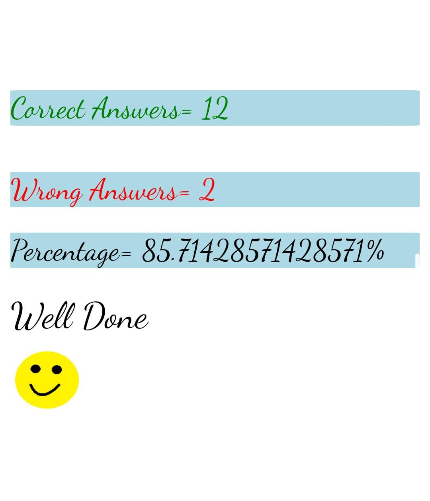

<!-- founder of javascrprt- brendam eich-1995 -(take ten days to make)
mocha => livescrpit => javascipt
world wide web-1990
netscape navigator-1994-2008-live script
scirpt says the element what they should do.
1995-internet explorer-2022-js script
ECMA script(European computer manufacturores association script)-1997
ecma script is the intitution that make standrds for the scripting langusages  (syntax)
ecma set rules when you write code
tc39-(technical committee 39)it works under ecma international and statderdies javascropt languages under ecma statdntidation
interpritted languages-javascript,python,ruby
compiled languages-java,c and c++,swift
javasript is the most popular language.,it is one language that is supported by all the major browsers.
IOS -learn swift
android-java
website-javasript
fundamentals-datatype,variables,operators,conditions,loops,functions
1.datatype
primitive-string,numbers ,boolean,undefines,null,symbol,bigint
non primitive-array,object
primit datatpyes -inbuilt datatypes
non primitive -derived from primitve datatypes
undefined-value not assingned
null-intentional absence of a value
array-ralated data enclosed in square bracket separated by coma
objects-collection of data in key-value payers enclosed in curly brasis seprated by coma -->

## 1-Who is the founder of JavaScipt and when?
####  JavaScript was invented Branden Eich in 1995  
## 2-What was the first browser,and when was it released?
####  WorldWideWeb in 1990 (later renamed Nexus).
## 3-Name the two dominant browsers in 2000
#### 1.Internet Explorer
#### 2.Netscape Navigator
## 4-What is ECMAScript?
#### ECMAScript is a standard for scripting languages, including JavaScript, JScript, and ActionScript. It is best known as a JavaScript standard intended to ensure the interoperability of web pages across different web browsers.
## 5-Define syntax?
#### In computer science, the syntax of a computer language is the rules that define the combinations of symbols that are considered to be correctly structured statements or expressions in that language.
## 6-What is TC39?
#### Ecma International's TC39 is the committee which defines ECMAScript (JavaScript) and related standards. This repository provides documentation into how TC39 works.
## 7-Name different data types in javascript
#### 1.string
#### 2.number
#### 3.boolean
#### 4.bigint
#### 5.undefined
#### 6.Null 
## 8-Explain primitive and non-primitive data types
#### Primitive data types are basic and include such values as integers, boolean, characters and other simple stored memory types. Nonprimitive data types are more complex values such as strings, objects, and arrays. Memory locations are different for both difference between primitive and non primitive data types.
## 9-Differentiate Null and undefined
#### undefined means a variable has been declared but has not yet been assigned a value, whereas null is an assignment value, meaning that a variable has been declared and given the value of null

